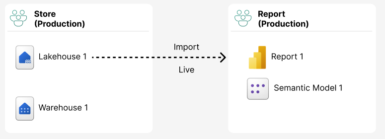
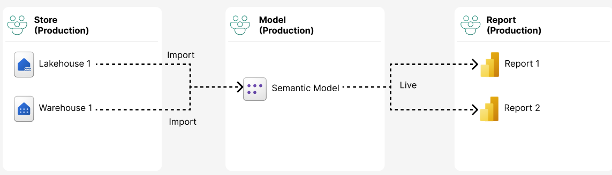
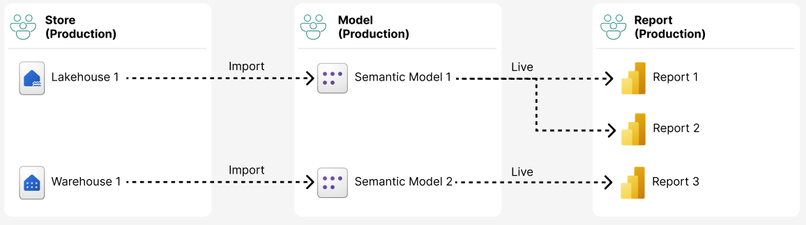
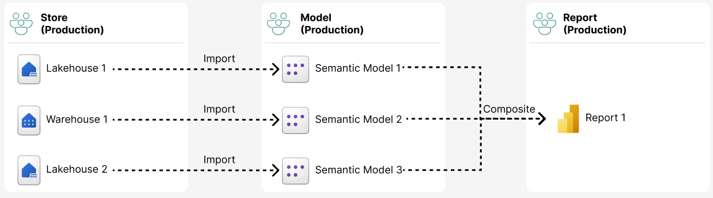
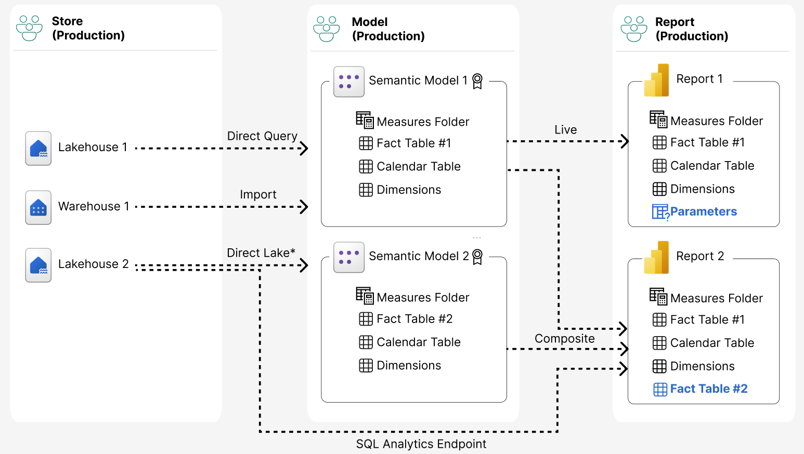

# Semantic Model Development Procedure

**Procedure ID:** APC-SOP-303 | **Document Type:** Standard Operating Procedure (SOP) | **Process Owner:** BI Analytics Team (BI) | **Lifecycle Phase:** Phase 3 – Develop (APC-PHASE-003) | **Status:** Draft — Rev 1 *(unconfirmed — see note below)*

> **Editorial note on this update (Rev 1):** This file was updated from a newly uploaded revision of the source document. The new source adds the five connection-pattern diagrams now embedded in Section 6, and the step numbering in Section 5 was tightened up — content is otherwise unchanged from Rev 0.
>
> The new source also **no longer includes** the document-control metadata block (Document Type / Process Owner / Lifecycle Phase / Status) or Sections 9–13 (Related Procedures, Related Standards, Related Templates, Related Checklists, Open APC Decisions), and the header now reads with no explicit status line. It's unclear whether that's a deliberate simplification of the published procedure or content that was dropped by accident while editing — the Revisions section in the new upload still says "14" even though only 8 numbered sections remain before it, which points toward an editing artifact rather than a clean intentional restructure. **To avoid silently losing information, this version carries the Section 9–13 content and the metadata block forward unchanged from the previous release.** Please confirm whether that's correct, or tell me to drop them, next time we're in the docs together.

[← Back to documentation index](../index.md)

---

## 1. Purpose

The purpose of this procedure is to define a repeatable, governed standard for developing Power BI / Microsoft Fabric semantic models on top of Gold layer curated data. This procedure covers the full path from Gold layer consumption pattern selection through dimensional modeling, semantic model build, DAX and measure design, performance optimization, security configuration, publishing, validation, and ongoing lifecycle management.

Semantic models are the governed consumption layer between Gold layer data assets (OBTs and Marts) and Power BI reports. This procedure establishes semantic models as independent, certified, and reusable data assets. Reports are built separately against a published semantic model; a semantic model is not embedded inside, or owned by, a single report.

This procedure is owned and executed by the BI Analytics Team. Data Engineering owns and maintains the Gold layer curated data (OBTs and Marts) that semantic models consume, but does not own semantic model design, build, security, or publishing decisions.

## 2. Scope

This procedure applies to all APC-governed semantic model development activities, including:

- New semantic models built on Gold layer OBTs or Marts
- Semantic models supporting certified, promoted, or practitioner-promoted reports and dashboards
- Composite or chained semantic models spanning multiple certified domain models
- Enhancements to existing certified semantic models that change grain, relationships, security, or published structure

This procedure applies to activities involving:

- BI Analytics Team (BI) — process owner
- Data Engineering Team (DE) — Gold layer source owner
- Business Stakeholders
- APC Representatives
- Analytics Leadership

This procedure does not cover Gold layer curation itself (Bronze → Silver → Gold pipeline development, governed by APC-SOP-301 and APC-SOP-302) or report/dashboard-level visual design (governed by APC-SOP-304 and APC-STD-009).

## 3. Roles & Responsibilities

#### BI Analytics Team (BI) — Process Owner

Responsible for:

- Scoping semantic models (OBT vs. Mart) and defining grain, facts, and dimensions
- Dimensional modeling, relationship design, and connectivity mode selection
- DAX measure and calculation group development
- Performance optimization and pre-publish validation
- RLS/OLS design, testing, and configuration
- Publishing, deployment pipeline promotion, and endorsement requests
- Model documentation and data dictionary maintenance
- Ongoing model ownership: refresh monitoring, change management, and lifecycle decisions

#### Data Engineering Team (DE) — Supporting Role

Responsible for:

- Owning and maintaining Gold layer curated data (OBTs and Marts)
- Maintaining conformed dimensions and surrogate keys at the Gold layer
- Communicating upstream schema changes that may affect published semantic models
- Supporting source-to-target reconciliation during validation

#### Business Stakeholder

Responsible for:

- Validating KPI logic and business rules reflected in measures
- Defining access/security group membership requirements for RLS
- Participating in UAT and providing sign-off

#### APC Representatives

Responsible for:

- Reviewing naming, modeling, and documentation standards conformance
- Reviewing endorsement (Promoted / Certified) requests
- Reviewing composite/chained model exception requests (Pattern 4)

#### Analytics Leadership

Responsible for:

- Approving cross-functional composite/chained semantic model exceptions
- Resolving escalated modeling, prioritization, or governance conflicts
- Approving promotion of a semantic model to single master data asset status

## 4. Definitions

| Term | Definition |
| --- | --- |
| Gold Layer | The consumption-ready layer of the medallion architecture; Silver tables joined, harmonized, and denormalized into curated data. |
| Curated Data | Gold layer output produced by joining and harmonizing Silver tables, branching into OBTs and Marts. |
| OBT (One Big Table) | A flattened, denormalized Gold layer table designed for simple, fast, single-purpose reporting. |
| Mart | A subject/domain-scoped, dimensionally modeled (star schema) grouping of facts and conformed dimensions for a specific business function. |
| Conformed Dimension | A dimension defined once and reused consistently across multiple Marts and semantic models (e.g., Date, Customer, Product). |
| Grain | The level of detail represented by a single row in a fact table or OBT. |
| Surrogate Key | A system-generated, non-business integer key used to relate dimension and fact tables. |
| SCD Type 2 | A historization technique that preserves dimension attribute history via new rows and effective date ranges. |
| Bridge Table | A table used to resolve a many-to-many relationship between a fact and a dimension, or between two dimensions. |
| Semantic Model | The governed Power BI / Fabric data model — tables, relationships, measures, and security — that business users and reports query. |
| Import Mode | A connectivity mode where data is loaded and stored in-memory (VertiPaq) in the semantic model on a refresh schedule. |
| DirectQuery | A connectivity mode where queries are passed through to the source system at query time; no data is imported. |
| Direct Lake | A Fabric connectivity mode that reads Delta tables directly from OneLake without a traditional Import refresh. |
| Composite Model | A semantic model combining more than one connectivity mode or more than one source semantic model (chaining). |
| RLS | Row-Level Security — restricts the rows of data a user can see based on role-based DAX filters. |
| OLS | Object-Level Security — restricts visibility of specific tables, columns, or measures for a given role. |
| Perspective | A named, filtered view of a semantic model's objects used to simplify the field list for a specific audience. |
| Calculation Group | A reusable set of DAX calculation items (e.g., time intelligence) applied across multiple base measures without duplicating logic. |
| Endorsement | Power BI's Promoted or Certified designation indicating a semantic model has met governance and quality requirements. |
| Deployment Pipeline | The Fabric mechanism for promoting workspace content through Dev, Test, and Prod stages. |
| TMDL | Tabular Model Definition Language — a source-control-friendly text representation of a semantic model definition. |

## 5. Procedure

The Procedure section is organized into eight sequential stages, from requirements and scoping through deployment and change management. Each stage lists ordered steps followed by a Best Practice callout.

### 5.1 Requirements & Scoping

1. Confirm Design phase outputs — approved BRD, reporting requirements, and KPI requirements — are available before scoping begins.
2. Determine the consumption pattern for the use case: OBT vs. Mart.
   - **Use an OBT when:** the need is served by a single flattened table, complexity is low, the use case is ad hoc or self-service, the user population is small, turnaround needs to be fast, and there is no expected reuse across subject areas.
   - **Use a Mart when:** multiple related facts are involved, the model needs to be reused across reports or domains, conformed dimensions must be shared enterprise-wide, many-to-many relationships exist, or the asset is intended as a long-term governed data product.
3. Document the OBT vs. Mart decision; escalate ambiguous cases to an APC Representative for review.
4. Define the grain of each fact table or OBT explicitly — state in one sentence what a single row represents — before development begins.
5. Identify required facts (additive, semi-additive, non-additive) and dimensions needed to satisfy the reporting requirements.
6. Map every dimension to the APC enterprise conformed dimension list (Date, Customer, Product, Plant/Location, Employee, etc.). New conformed dimensions require APC review before creation to avoid duplication.
7. Confirm the Gold layer curated data (OBT/Mart) satisfies the required grain, facts, and dimensions. Escalate any gaps to Data Engineering as a Gold layer change request.

> **Best practice:** Always model against Gold layer curated data — never Silver or Bronze directly. A semantic model built on ungoverned layers bypasses conformance checks and cannot be certified.

### 5.2 Dimensional Modeling Standards

1. Design in a star schema: a central fact table (or tables) surrounded by conformed dimension tables. Avoid snowflaking except where a hierarchy is explicitly reused and snowflaking materially reduces redundancy.
2. Relate fact and dimension tables on surrogate keys, not natural or business keys. Surrogate keys are generated and maintained at the Gold layer.
3. Handle SCD Type 2 dimensions sourced from Silver's historized tables by exposing only the current-row or point-in-time attributes required for the model's grain. Use effective-dated surrogate keys on the fact table where historical accuracy (e.g., "as of transaction date" attributes) is required.
4. Use bridge tables to resolve many-to-many relationships (e.g., Account-to-Sales-Representative). Mark a relationship as many-to-many only when a bridge table cannot reasonably be avoided, and validate the performance impact before publishing.
5. Use the single APC-governed Date dimension in every model, marked as the model's official Date table. Time-of-day dimensions, where required, are modeled separately from the Date dimension.
6. Default every dimension-to-fact relationship to single-direction filtering. Bi-directional relationships require a documented, narrow justification (e.g., an unavoidable bridge table).

> **Best practice:** A clean star schema with single-direction filters is the single biggest lever for both performance and DAX simplicity. Resist adding a bi-directional relationship as a shortcut around a modeling problem.

### 5.3 Semantic Model Build & Connectivity Mode Selection

1. Create or open the semantic model in a dedicated BI-owned Fabric workspace at the Dev stage of the deployment pipeline. Do not build directly in a Prod workspace.
2. Connect to the Gold layer Mart or OBT via the Lakehouse SQL Analytics Endpoint or Warehouse endpoint.
3. Select the connectivity mode using the guidance below.

| Mode | When to Use |
| --- | --- |
| Import (default) | Governed, certified semantic models; best query performance and full DAX support; use for the majority of Marts and OBTs. |
| Direct Lake | Large Gold Lakehouse tables requiring near-real-time freshness without Import refresh overhead. Requires OneLake-hosted Delta tables and Fabric capacity; validate fallback-to-DirectQuery behavior and calculated column/table constraints before promoting. |
| DirectQuery | Used only when data volume or freshness requirements prevent Import or Direct Lake, or when source-enforced security requires live queries. Expect DAX and performance limitations. |
| Composite | Reserved for the approved cross-functional exception (Pattern 4, Section 6) combining multiple certified semantic models, or supplementing a Live-connected model with a small local table (e.g., targets, what-if parameters). Not a substitute for proper Mart design. |

4. Build relationships matching the dimensional model defined in Section 5.2. Validate cardinality and cross-filter direction for every relationship.
5. Organize model objects into display folders (Measures, Dimensions, Facts) and hide surrogate keys and technical columns from report view.
6. Set default summarization to None on numeric columns that are not intended for direct drag-and-drop aggregation.

> **Best practice:** Import remains the default. Only move to DirectQuery, Direct Lake, or Composite with a documented business justification — every non-Import mode trades away DAX functionality, performance predictability, or both.

### 5.4 DAX & Measure Design

1. Build base measures first (SUM/COUNT-level building blocks). Compose derived and business measures from base measures. Never duplicate the same logic across multiple measures.
2. Use calculation groups for reusable time-intelligence and unit-conversion patterns (YTD, QTD, Prior Year, % Change) instead of creating a duplicate measure per period per base measure.
3. Follow the APC naming convention for measures: [Domain] [Metric] [Modifier], Title Case, no abbreviations unless enterprise-standard (e.g., "Sales Revenue YTD").
4. Store all measures in a dedicated Measures Folder/table rather than scattering measures across individual fact tables.
5. Document each measure's business definition and DAX logic in the model's data dictionary (Section 5.6.9). Every published measure supporting a KPI must trace to an approved KPI definition per APC-STD-003.

> **Best practice:** If a measure formula is copy-pasted more than once with only a filter changed, it belongs in a calculation group — not as a new standalone measure.

### 5.5 Performance Optimization

1. Minimize column cardinality: exclude unused columns, avoid importing high-cardinality free-text or GUID columns unless required, and split datetime columns into Date and Time when only date-level analysis is needed.
2. Use aggregation tables for high-volume fact tables queried primarily at a summarized grain; configure Import-mode aggregations over a DirectQuery or Direct Lake detail table where appropriate.
3. Configure incremental refresh policies on large fact tables using RangeStart/RangeEnd parameters. Confirm the Gold layer supports query folding for the refresh predicate.
4. Validate query folding using the Power Query diagnostics or step-by-step view before publishing. Resolve any transformation step that breaks folding by pushing that logic upstream into Gold.
5. Run VertiPaq Analyzer or Best Practice Analyzer before publishing. Review table and column size, cardinality outliers, unused columns and measures, and unnecessary bi-directional or many-to-many relationships.

> **Best practice:** Run VertiPaq Analyzer as a standard pre-publish gate, not a troubleshooting step reserved for when a model is already slow in production.

### 5.6 Security, Governance & Publishing

This stage covers the full step-by-step publishing process, including Row-Level Security (RLS) and Object-Level Security (OLS) configuration.

1. Design Row-Level Security (RLS): define security roles aligned to business dimensions (e.g., Region, Plant, Cost Center). Build DAX filter expressions on dimension tables — never on fact tables. Use dynamic RLS via a Security/User-mapping table joined to USERPRINCIPALNAME() for scalable role assignment rather than static per-user roles.
2. Design Object-Level Security (OLS) where specific tables, columns, or measures must be hidden from a subset of users (e.g., cost or margin columns). Configure OLS using Tabular Editor, since Power BI Desktop does not natively expose OLS configuration.
3. Test every RLS/OLS role using "View As Roles" in Power BI Desktop, validating at least one representative test case per role, before publishing.
4. Define Perspectives for domain-specific views (e.g., a Finance perspective that hides Supply Chain tables) to simplify the field list for business users without creating a separate semantic model.
5. Publish the semantic model to the Dev workspace stage of the Fabric deployment pipeline. Do not publish directly to Test or Prod.
6. Configure data source credentials and connection (gateway or cloud connection) and set up a scheduled refresh for Import mode, or verify Direct Lake / DirectQuery connectivity in workspace settings.
7. Assign workspace roles: BI Analytics Team as Admin/Member on the Dev workspace; restrict Prod workspace edit access to designated model owners only.
8. Configure RLS role membership in the Power BI Service (semantic model Security settings) by assigning Microsoft Entra security groups — not individual users — to each role.
9. Complete model documentation: publish a data dictionary covering every table, column, and measure, and, where feasible, maintain the model definition in TMDL via Fabric Git integration as the source-controlled source of truth.
10. Submit the model for APC review against APC-STD-001 (Naming), APC-STD-003 (KPI Governance), APC-STD-004 (Data Modeling), and APC-STD-008 (Security & Access).
11. Promote through the deployment pipeline: Dev → Test (validate with sample business users and RLS spot-checks) → Prod, using the Fabric deployment pipeline compare-and-deploy function rather than a manual re-publish.
12. Request endorsement: apply for Promoted status upon Test sign-off, and Certified status after APC review and Analytics Leadership approval, per APC-STD-007 (extended to semantic models).
13. Enable the XMLA endpoint (Read or Read/Write, per Fabric capacity settings) only if the model will be consumed by external tools or by a composite/chained semantic model (Pattern 4). Document the business justification.
14. Publish connected reports separately — reports must not be embedded inside the semantic model file. Grant Build permission on the semantic model to report authors, and grant viewer access via the app or workspace audience, rather than re-publishing the model with each new report.

> **Best practice:** Treat RLS/OLS role assignment through Microsoft Entra security groups as non-negotiable. Assigning individual users directly to roles does not scale and creates an unmanaged access list outside of IT identity governance.

### 5.7 Validation & UAT

1. Reconcile semantic model measure outputs against Gold layer source-of-truth queries (SQL against the Mart/OBT) for a representative sample of dimension combinations and time periods.
2. Validate RLS and OLS enforcement using representative test accounts for every defined role.
3. Execute UAT with business stakeholders using approved UAT scenarios (APC-SOP-307). Validate KPI values, filter and slicer behavior, and expected totals.
4. Document and resolve discrepancies. Log accepted variances with a documented business justification.
5. Obtain formal business sign-off before promoting the model to Prod, consistent with the Deliver phase business sign-off activity (APC-PHASE-004, Section 5.8).

> **Best practice:** Reconcile at the grain, not just the total. Totals can match by coincidence while a specific dimension combination underneath is wrong.

### 5.8 Deployment & Change Management

1. Version the semantic model using Fabric Git integration (or equivalent source control) tied to the Dev workspace. Commit meaningful change descriptions with every change.
2. Promote through the Fabric deployment pipeline: Dev → Test → Prod. Never edit the Prod copy of a semantic model directly.
3. Configure refresh-failure alerting (Power BI Service alerts or Fabric monitoring) routed to the model owner and a BI team distribution channel.
4. Maintain a change log for schema changes, measure changes, and RLS role changes. Communicate breaking changes — renamed or removed fields, changed grain — to downstream report owners before promotion.
5. Assign a named Model Owner from the BI Analytics Team accountable for refresh health, documentation currency, and access requests. Review ownership at least annually or upon role change.
6. Route enhancement requests through the Enhance phase (APC-PHASE-007) rather than making ad hoc edits to a certified model.
7. Evaluate retirement candidacy through the Retire phase (APC-PHASE-008) when usage drops or the model is superseded by another certified asset.

> **Best practice:** A certified semantic model is a product, not a one-time project deliverable. Budget ongoing ownership time for refresh monitoring, documentation upkeep, and change communication — not just the initial build.

## 6. Semantic Layer Connection Patterns

The following patterns describe accepted approaches for connecting Gold layer data assets to semantic models and reports. Patterns 2 and 3 are the APC-preferred approaches for all new development, consistent with the standing preference for independent, reusable semantic models that are not embedded inside a single report. Pattern 1 is a legacy/discouraged pattern. Pattern 4 is an approved exception requiring Analytics Leadership sign-off.

#### Pattern 1 — Reports Built Directly on Lakehouse/Warehouse (Discouraged / Legacy)

A report connects directly to a Lakehouse or Warehouse (Import or Live) with its semantic model embedded inside the report file, rather than published as an independent, shared semantic model.

**Why discouraged:** no reuse across reports; every report re-implements its own measures and relationships, risking inconsistent KPI logic; the model cannot be centrally governed, secured (RLS/OLS), or certified as a shared asset.

**When it may still occur:** rapid prototyping or a genuinely one-off, single-report analysis with no expected reuse. Any report built this way must not be promoted to Prod or certified without first extracting an independent semantic model.

#### Pattern 2 — Certified Semantic Model, Single Master Data Asset (Preferred — Simple Domains)

One or more Gold sources (Lakehouse/Warehouse, Import) feed a single certified semantic model. Multiple reports connect Live to that one model.

**Use when:** a single domain or subject area with one governed data asset serves all related reporting needs.

#### Pattern 3 — Certified Semantic Models, Reusable Domain-Specific Assets (Preferred — Multi-Domain)

Each domain (e.g., Supply Chain Mart, Finance Mart) has its own certified semantic model, each fed by its own Gold source(s). Each model serves one or more reports via a Live connection.

**Use when:** multiple distinct business domains exist, each warranting its own conformed, independently owned semantic model. This is the default target-state pattern for the APC library.

#### Pattern 4 — Certified Semantic Models, Cross-Functional / Composite (Approved Exception)

A cross-functional report needs data spanning more than one certified domain semantic model. Connect using a composite model — DirectQuery to Power BI semantic models (semantic model chaining) — combining two or more certified models, optionally supplemented with a small local table.

Governance requirements:

- Requires Analytics Leadership approval before use; this pattern introduces cross-model dependency and query-performance risk.
- Both source semantic models must already hold Certified status.
- The composite/chained model must itself be documented and security-reviewed. RLS from the source models is enforced through the chain but must be re-validated end to end.
- If reused by more than one report, the composite model must be published as its own governed semantic model rather than rebuilt per report.
- Requires the XMLA endpoint and appropriate Fabric capacity settings on the source semantic models.

#### Additional Pattern — Direct Lake

A Lakehouse table connects to a semantic model via Direct Lake mode over the SQL Analytics Endpoint / OneLake, avoiding a full Import refresh while retaining near-Import query performance.

**Use when:** near-real-time freshness on large Lakehouse tables is required and Fabric capacity supports Direct Lake. Validate fallback-to-DirectQuery behavior and calculated column/table constraints before promoting to Prod.

**Open item:** the composite connection type for cross-functional chaining (Pattern 4) has not yet been ratified as a formal APC standard. This SOP designates DirectQuery to Power BI semantic models (chained composite models) as the interim approved method pending a formal APC decision — see Section 13, Open APC Decisions.

## 7. Inputs

The following inputs may initiate semantic model development:

- Approved Design Phase Outputs (BRD, Technical Specification, Data Model Design)
- Gold Layer Curated Data (OBT or Mart)
- APC Conformed Dimension List
- Approved KPI Definitions
- APC Naming and Documentation Standards
- Security and Access Requirements

## 8. Outputs

This procedure may produce:

- Published Semantic Model (Dev / Test / Prod)
- Data Dictionary and Model Documentation (including TMDL where applicable)
- RLS / OLS Role Definitions and Security Group Mappings
- Reconciliation Results
- UAT Sign-Off
- Deployment Pipeline Record
- Endorsement Status (Promoted / Certified)

## 9. Related Procedures

*(Carried forward from the previous version — see editorial note at the top of this file.)*

| Procedure ID | Procedure Name |
| --- | --- |
| APC-SOP-301 | Data Pipeline Development Procedure |
| APC-SOP-302 | Data Validation Procedure |
| APC-SOP-304 | Dashboard Development Procedure |
| APC-SOP-305 | KPI Development Procedure |
| APC-SOP-306 | Documentation Procedure |
| APC-SOP-307 | UAT Scenario Development Procedure |

## 10. Related Standards

*(Carried forward from the previous version — see editorial note at the top of this file.)*

| Standard ID | Standard Name |
| --- | --- |
| APC-STD-001 | Naming Standards |
| APC-STD-002 | Documentation Standards |
| APC-STD-003 | KPI Governance Standard |
| APC-STD-004 | Data Modeling Standard |
| APC-STD-005 | Medallion Architecture Standard |
| APC-STD-006 | Fabric Architecture Standard |
| APC-STD-007 | Report Certification Standard |
| APC-STD-008 | Security & Access Standard |

## 11. Related Templates

*(Carried forward from the previous version — see editorial note at the top of this file.)*

| Template ID | Template Name |
| --- | --- |
| APC-TMP-012 | Semantic Model Documentation Template |
| APC-TMP-013 | KPI Definition Template |
| APC-TMP-[PENDING] | Semantic Model Data Dictionary Template |
| APC-TMP-[PENDING] | RLS / OLS Role Matrix Template |
| APC-TMP-[PENDING] | OBT vs. Mart Decision Worksheet |

## 12. Related Checklists

*(Carried forward from the previous version — see editorial note at the top of this file.)*

| Checklist ID | Checklist Name |
| --- | --- |
| APC-CHK-011 | Documentation Completeness Checklist |
| APC-CHK-[PENDING] | Semantic Model Publish Readiness Checklist |
| APC-CHK-[PENDING] | RLS / OLS Validation Checklist |

## 13. Open APC Decisions

*(Carried forward from the previous version — see editorial note at the top of this file.)*

The following unresolved APC decisions may impact execution of this procedure.

#### APC-OD-001: Composite / Chained Semantic Model Standard

The approved connection type and governance model for cross-functional composite semantic models (Pattern 4) has not been formally ratified.

#### APC-OD-002: OBT vs. Mart Decision Criteria

Formal, ratified criteria for choosing between an OBT and a Mart are not yet published as an APC standard; current guidance is captured in Section 5.1 pending formal review.

#### APC-OD-003: Direct Lake Adoption Standard

Enterprise-wide Fabric capacity requirements and adoption timeline for Direct Lake mode have not been finalized.

#### APC-OD-004: Semantic Model Certification Criteria

Final certification criteria specific to semantic models (as distinct from report certification under APC-STD-007) remain under review.

## Revisions

| Issue Date | Rev | Change | Written / Revised by |
| --- | --- | --- | --- |
|  | 0 | Initial Release |  |
| 2026-08-17 | 1 | Added the five connection-pattern diagrams to Section 6 (Pattern 1–4 + Direct Lake); tightened Section 5 step numbering. Source upload for this revision no longer included the document-control metadata block or Sections 9–13 — those sections are carried forward unchanged from Rev 0 pending confirmation. |  |
|  |  |  |  |

Remove the yellow highlight from previous versions of the document when making changes. Then highlight all new document changes in yellow for quick reference. An original issue document will have no highlights.
