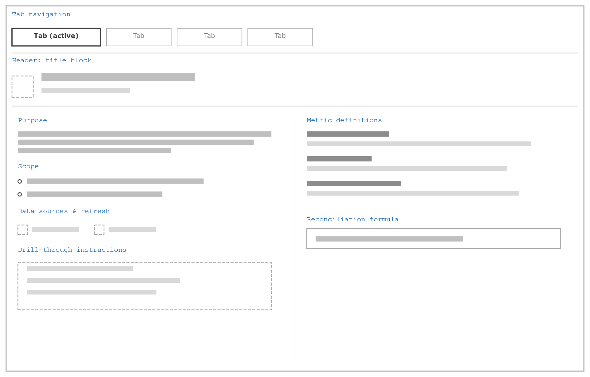
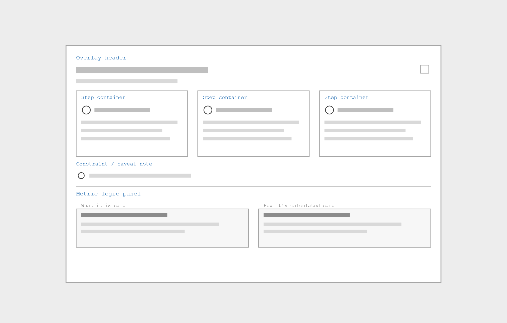
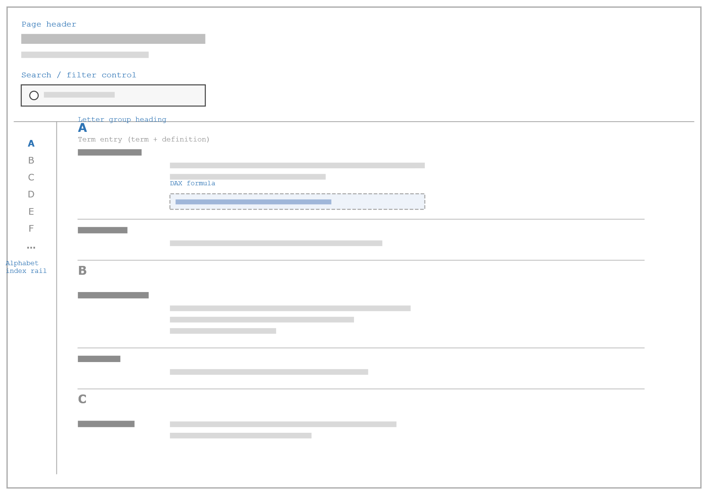

# Documentation Procedure (In-Report)

**Procedure ID:** APC-SOP-306 | **Lifecycle Phase:** Phase 3 – Develop (APC-PHASE-003)

[← Back to documentation index](../index.md)

---

## 1. Purpose

The purpose of this procedure is to establish a consistent, repeatable approach for documenting APC-governed reports and dashboards directly within the report itself. In-report documentation ensures that report purpose, scope, navigation logic, and calculation logic are available to end users at the point of use — supporting self-service analytics, reducing support burden, and satisfying APC governance and certification expectations without requiring users to leave the report.

This procedure standardizes three recurring in-report documentation patterns observed across existing Carlisle BI dashboards: the Info Page, In-Page Documentation, and the Glossary of Terms.

## 2. Scope

This procedure applies to all APC-governed reports and dashboards requiring in-report documentation, including:

- Executive and operational dashboards
- Semantic-model-backed reports
- Multi-page reports with page-specific interaction or calculation logic
- Reports containing recurring business or technical terminology

This procedure covers documentation that is embedded in the report itself (physical pages and page-level overlays). It does not cover:

- External documentation maintained outside the report (see APC-SOP-306, Documentation Procedure)
- Documentation maintenance activities post-publication (see APC-SOP-054, Documentation Maintenance Procedure)
- The enterprise business glossary maintained independently of any single report

This procedure applies to activities involving:

- Business Stakeholders
- BI Analytics Team (BI)
- APC Representatives
- Analytics Leadership

## 3. Roles & Responsibilities

#### Business Stakeholder

Responsible for:

- Validating that documented definitions, calculation logic, and business rules are accurate
- Reviewing in-report documentation prior to publication

#### BI Analytics Team (BI)

Responsible for:

- Determining which documentation pattern(s) a report requires
- Developing and publishing Info Pages, In-Page Documentation, and Glossary of Terms pages
- Maintaining in-report documentation as reports change

#### APC Representatives

Responsible for:

- Reviewing in-report documentation for standards alignment and consistency across the library
- Supporting certification reviews where in-report documentation is a requirement

#### Analytics Leadership

Responsible for:

- Resolving disputes over documentation scope or content
- Supporting prioritization when documentation effort competes with development timelines

## 4. Definitions

**Info Page** — A dedicated, physical report page (typically the leftmost or first tab, labeled "Info") providing whole-report orientation: Purpose, Scope, refresh frequency, data sources, drill-through instructions, and a metric/term reference. One Info Page per report.

**In-Page Documentation** — A group of visuals built as an overlay on top of a specific report page's canvas, shown and hidden using a bookmark action rather than page navigation. It is not a separate page; it lives on top of the page it documents and is scoped to that page's navigation and/or calculation logic. It can recur across multiple pages in the same report.

**Glossary of Terms** — A dedicated, physical report page listing business and technical terms alphabetically, each paired with a plain-language definition and, for terms backed by a calculated measure, the underlying DAX formula. Unlike the Info Page's metric reference (scoped to that report's own measures) or In-Page Documentation's calculation logic (scoped to one page), the Glossary gives users a single, browsable reference for terminology used anywhere in the report — independent of any one metric or page.

**Bookmark** — A saved state of a report page's visuals (visibility, filters, selections) that can be applied on demand by a button or icon action, used to show and hide In-Page Documentation without navigating away from the page.

**Drill-Through Instructions** — Documented steps explaining how a user navigates from a summary visual to underlying detail (e.g., right-click > Drill Through > [target page]).

**Metric Definition** — A named measure paired with a plain-language description of what it represents and, where applicable, its calculation logic.

**Reconciliation Formula** — A stated relationship showing how a set of metrics sum or resolve to a total (e.g., Total Past Due + Revenue at Risk + Orders OK = Total Backlog), used to confirm metrics are mutually exclusive and complete.

**Root Cause / Category Breakdown** — A set of named categories (e.g., reasons a metric is flagged) each paired with a one-line plain-language definition, typically color-coded to indicate whether the category represents a blocked/at-risk condition or an on-track condition.

## 5. Procedure

### 5.1 Determine Documentation Requirements

Every report requires an Info Page at minimum. In-Page Documentation and a Glossary of Terms are added based on report complexity and terminology needs.

| Pattern | Implementation | Use when… |
| --- | --- | --- |
| Info Page | Physical report page (tab) | Always — every published report requires one |
| In-Page Documentation | Overlay on the page canvas, shown/hidden via bookmark | A specific page has non-obvious interaction logic (cascading filters, drill-throughs, parameter toggles) or page-specific calculation logic that needs explanation in context |
| Glossary of Terms | Physical report page (tab) | The report uses recurring business or technical terms that benefit from a single, alphabetized, searchable reference independent of any one metric or page |

### 5.2 Develop the Info Page

The Info Page shall be built as a dedicated, physical report page (labeled "Info," positioned first in the tab order) and shall include:

- Report-branded header with report/dashboard title
- Purpose — short paragraph describing what the report is for and who it serves
- Scope — what the report covers, broken into named sub-sections when the report spans multiple pages
- Refresh Frequency — stated explicitly
- Data Sources — source systems feeding the report (e.g., JDE, SAP, Synapse)
- Drill-Through Instructions, where applicable — numbered/bulleted steps with a screenshot of the right-click menu and a note on how to return to the prior view
- Key Principles, where applicable — sort order, tie-breaker logic, or other non-obvious business rules
- A metric definitions reference, using a bolded term followed by a plain-language description, including any reconciliation formula that ties metrics together
- For multi-page reports, a page-by-page breakdown describing each page's purpose in place of (or alongside) the metric reference

*Figure 1. Info Page — low-fidelity template*

### 5.3 Develop In-Page Documentation

Where a page requires its own documentation, it shall be built as a group of overlay visuals on that page's canvas, controlled by bookmarks:

- A default bookmark in which the overlay is hidden and the underlying page is fully interactive
- A documentation bookmark in which the overlay is shown, positioned above the page's visuals (typically with a semi-transparent backdrop to focus attention)
- An icon or button on the page bound to a bookmark action that applies the documentation bookmark
- A close (X) control within the overlay bound to a bookmark action that restores the default bookmark

Overlay content shall follow one of two formats (or both, on separate overlays within the same page):

- Interaction/navigation logic — numbered, sequential steps or cascade stages, each describing what the control shows, what the user clicks, and what it filters; explicit callouts for non-obvious behavior (e.g., "this does not filter upstream")
- Calculation/metric logic — one card or block per metric, stating what it is and how it is calculated, including timeframe-sensitivity notes, reconciliation formulas, and color-coded category breakdowns where relevant

Known limitations or data caveats shall be stated explicitly (e.g., "a blank date is not currently evaluated as past due").

*Figure 2. In-Page Documentation — low-fidelity template (bookmark-driven overlay)*

### 5.4 Develop a Glossary of Terms

Where a report's terminology benefits from a single alphabetized reference, a dedicated, physical Glossary of Terms page shall be built with:

- Report-branded header naming the report
- A search or filter control, where practical, to help users locate a term quickly
- An alphabet index/rail for jumping directly to a letter
- Terms grouped under letter headings, each entry consisting of a bolded term followed by a one- or two-sentence plain-language definition
- For terms backed by a calculated measure, the underlying DAX formula, shown in a monospaced/code-styled block beneath the definition
- Where a term requires more explanation than a short definition allows, the entry should point to the relevant In-Page Documentation rather than expanding in place

*Figure 3. Glossary of Terms — low-fidelity template (includes DAX formula reference)*

### 5.5 Review for Accuracy and Completeness

Business Stakeholders shall review all in-report documentation for accuracy of definitions, calculation logic, and business rules prior to publication.

### 5.6 Validate Against Standards

BI Analytics shall confirm the documentation follows this procedure's formatting conventions and applicable APC standards (APC-STD-002, APC-STD-007) before publishing.

### 5.7 Publish and Maintain

Documentation shall be published alongside the report and reviewed for updates whenever the report's metrics, pages, or logic change.

## 6. Inputs

- Approved report or dashboard (in development or already published)
- Metric and KPI definitions
- Business rules and calculation logic
- Data source and refresh information
- Prior versions of in-report documentation, if updating

## 7. Outputs

- Published Info Page
- Published In-Page Documentation overlay(s) and associated bookmarks, where applicable
- Published Glossary of Terms page, where applicable
- Documentation completeness confirmation

## 8. Related Standards

| Standard ID | Standard Name |
| --- | --- |
| APC-STD-002 | Documentation Standards |
| APC-STD-007 | Report Certification Standard |

## 9. Open APC Decisions

The following unresolved APC decisions may impact execution of this procedure.

#### APC-OD-001: Mandatory Pattern Requirements

Whether all three in-report documentation patterns are mandatory at certain certification tiers has not yet been approved.

#### APC-OD-002: Overlay Trigger Convention

Whether a standard icon and bookmark-naming convention should be required for In-Page Documentation overlays remains under review.

## Revisions

| Issue Date | Rev | Change | Written / Revised by |
| --- | --- | --- | --- |
|  | 0 | Initial Release |  |
|  |  |  |  |

Remove the yellow highlight from previous versions of the document when making changes. Then highlight all new document changes in yellow for quick reference. An original issue document will have no highlights.
